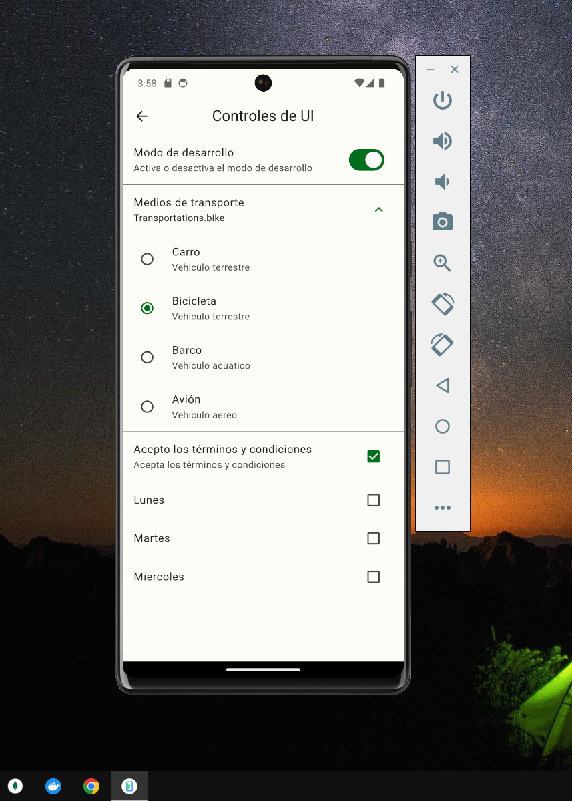

# Diferentes Widgets en Flutter

## Descripción
Una aplicación de ejemplo en Flutter que muestra diferentes widgets y funcionalidades básicas de la biblioteca Flutter.

## **Select Language:**
- [Español (Spanish)](README-es.md)
- [English](README.md)

## Result
### Video General

### Home
 
### Buttons
 
### Cards 
 
### Cards of Image
 
### Progress Indication 
 
### Dialogs and snackbar
 
### Animated Part 1
 
### Animated Part 2
 
### UI Controls
 
### App of Tuturial
 
### Scroll Infinite, Refresh
 

## Dependencias
- animate_do: ^3.3.4
- flutter: SDK de Flutter
- go_router: ^13.2.2

## Dependencias de desarrollo
- flutter_test: SDK de Flutter
- flutter_lints: ^3.0.0

## Configuración de Flutter
- Se utiliza el diseño de Material.

## Recursos
- Se incluyen imágenes en el directorio "assets/images/".

## Funcionalidades

### Botones
- Muestra varios tipos de botones disponibles en Flutter.

### Tarjetas
- Muestra diferentes estilos de tarjetas.

### Indicadores de Progreso
- Muestra indicadores de progreso circulares y lineales.

### SnackBar y Diálogos
- Muestra cómo utilizar SnackBar y cómo crear diálogos personalizados.

### Animación de Contenedores
- Realiza animaciones básicas en un contenedor.

### Controles de UI
- Muestra controles de usuario básicos como botones personalizados.

### Tutorial
- Un tutorial simple con diapositivas.

### Infinite Scroll
- Implementa una lista infinita con carga dinámica de imágenes.

## Uso
La aplicación está configurada con rutas para cada funcionalidad, las cuales se pueden acceder mediante la navegación en la aplicación.

## Contribuyendo
¡Las contribuciones son bienvenidas! Si encuentras algún problema o deseas agregar nuevas funcionalidades, no dudes en enviar una solicitud de extracción.

## Licencia
Este proyecto está bajo la Licencia MIT. Consulta el archivo `LICENSE` para más detalles.
