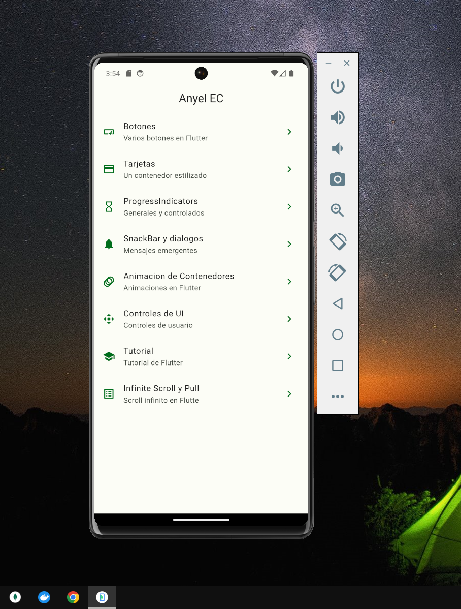

# widgets app in Flutter

## Description
A sample Flutter application showcasing various widgets and basic functionalities of the Flutter framework.

## **Select Language:**
- [Español (Spanish)](README-es.md)
- [English](README.md)

## Result
### Video General
🎥 
### Home
 
### Buttons
 
### Cards 
 
### Cards of Image
 
### Progress Indication 
 
### Dialogs and snackbar
 
### Animated Part 1
 
### Animated Part 2
 
### UI Controls
 
### App of Tuturial
 
### Scroll Infinite, Refresh
 

## Dependencies
- animate_do: ^3.3.4
- flutter: Flutter SDK
- go_router: ^13.2.2

## Development Dependencies
- flutter_test: Flutter SDK
- flutter_lints: ^3.0.0

## Flutter Configuration
- Material design is used.

## Resources
- Images are included in the "assets/images/" directory.

## Features

### Buttons
- Displays various types of buttons available in Flutter.

### Cards
- Displays different styles of cards.

### Progress Indicators
- Shows circular and linear progress indicators.

### SnackBar and Dialogs
- Demonstrates how to use SnackBar and create custom dialogs.

### Container Animation
- Performs basic animations on a container.

### UI Controls
- Shows basic user controls like custom buttons.

### Tutorial
- A simple tutorial with slides.

### Infinite Scroll
- Implements an infinite list with dynamic loading of images.

## Usage
The application is configured with routes for each feature, which can be accessed by navigating within the app.

## Contributing
Contributions are welcome! If you find any issues or want to add new features, feel free to submit a pull request.

## License
This project is licensed under the MIT License. See the `LICENSE` file for details.
